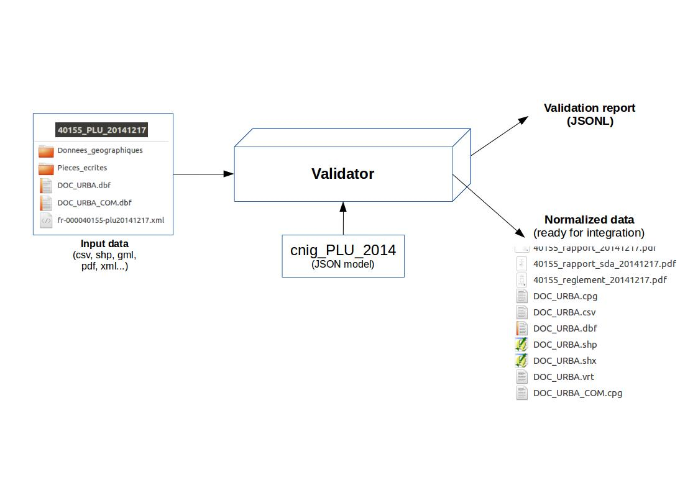

# Validator

[](https://github.com/IGNF/validator/actions/workflows/main.yml)
[](https://raw.githubusercontent.com/IGNF/validator/master/LICENCE.md)

## Description

> This programs allows to validate datasets (a folder containing shapefiles, PDF, etc.) according to a file mapping and a FeatureCatalog. It outputs a report describing validation errors and normalized data ready for database integration.
> It has been developed for the [*géoportail de l'urbanisme*](https://www.geoportail-urbanisme.gouv.fr) to validate urbanism data according to [CNIG standards](https://www.geoportail-urbanisme.gouv.fr/standard/) and allow merging in a national database.

Ce programme permet de valider et de normaliser les données présentes dans une arborescence de fichiers. Ces données peuvent être :

* Des tables, géographiques ou non, aux formats CSV, GML, Shapefile ou MapInfo
* Des fiches de métadonnées
* Des fichiers PDF
* Des dossiers (principalement pour contrôle de présence)

Le paramétrage s'effectue à l'aide de [fichiers JSON décrivant des arborescences de fichiers et des tables](validator-core/src/main/resources/schema/README.md).

## Cas d'usage

* [Géoportail de l'Urbanisme](https://www.geoportail-urbanisme.gouv.fr) : Validation des données en fonction des [standards CNIG PLU, POS, CC, PSMV, SUP et SCOT](https://www.geoportail-urbanisme.gouv.fr/standard/) en amont de l'aggrégation dans une base nationale.
* [Validateur TRI](https://validateur-tri.ign.fr/) : Validation de la conformité d'un jeu de données géographiques sur les territoires à risque important d'inondation (TRI) vis à vis du standard de données COVADIS du thème "Directive Inondation" version 2.

## Principe de fonctionnement

Le schéma suivant illustre le [Principe de fonctionnement du validateur de document](doc/principe.md) :



## Principales fonctionnalités

| Groupe                                | Fonctionnalité                                                                                                                                                                                                                       |
|---------------------------------------|--------------------------------------------------------------------------------------------------------------------------------------------------------------------------------------------------------------------------------------|
| Modèle de données                     | Modélisation d'arborescence de fichiers : Fichiers attendus (optionnel ou oubligatoire) avec mise en correspondance chemin et modèle de table)                                                                                       |
| Modèle de données                     | Modélisation de la structure d'une table (spatiale ou non) par définit de la liste de la liste des attributs                                                                                                                         |
| Modèle de données                     | Modélisation d'un attribut de table par définition du type, de valeurs autorisées, d'une expression régulière, etc.)                                                                                                                 |
| Validation d'un dossier               | Contrôle de la présence de dossier et de fichiers dans une arborescence suivant des expressions régulières                                                                                                                           |
| Validation d'une table                | Lecture des formats CSV, Shapefile, MapInfo, GML (possibilité d'étendre aux formats supportés par ogr2ogr de GDAL)                                                                                                                   |
| Validation d'une table                | Validation de l'encodage des chaînes de caractères (problème encodage UTF-8, LATIN1, etc.), détection des caractères non affichable et simplification pour un meilleur support par les différentes charsets et polices de caractères |
| Validation d'un attribut géométrique  | Validation du type géométrique avec conversion automatique entre géométrie simple et multiple quand la données le permet                                                                                                             |
| Validation d'une fiche de métadonnées | Validation des fiches de métadonnées suivants les principales contraintes INSPIRE                                                                                                                                                    |
| Rapport d'erreur                      | Production d'un rapport d'erreur au format JSON avec des erreurs porteuses d'un code d'erreur, d'un message et d'un niveau de gravité (bloquant pour l'intégration des données en base?)                                             |
| Plugin CNIG                           | Extension permettant de traiter des aspects spécifiques aux standards CNIG PLU, POS, CC, PSMV, SCOT et SUP (consigne de saisie des métadonnées, IDURBA, TYPEREF, etc.)                                                               |
| Plugin DGPR                           | Extension permettant de traiter des aspects spécifiques à la validation du standard COVADIS "Directive innondation v2.0" (en particulier, la topologie des différentes couches)                                                      |
| Normalisation des données             | Production de données données conformes au modèle de validation pour intégration en base de données (format CSV)                                                                                                                     |
| Normalisation des données             | Conversion des fiches de métadonnées XML dans un modèle pivot JSON                                                                                                                                                                   |

## Licence

Voir [LICENCE.md](LICENCE.md)

## Documentation technique

* [Exemples de modèles de document (french)](validator-core/src/test/resources/config-json/README.md)
* [Modélisation des données (french)](validator-core/src/main/resources/schema/README.md)
* [Liste des codes d'erreurs (json)](validator-core/src/main/resources/error-code.json)
* [Projection supportées (json)](validator-core/src/main/resources/projection.json)
* [Metadata modelization (english)](doc/metadata.md)
* [Characters validation (english)](doc/characters/index.md)
* [plugin-cnig - validation des champs IDURBA](doc/plugin-cnig/idurba.md)
* [plugin-cnig - Validation des mots clés en fonction des CSMD CNIG](doc/plugin-cnig/keywords.md)

## Cas d'utilisation

Ce programme a été développé dans le cadre du [géoportail de l'urbanisme](https://www.geoportail-urbanisme.gouv.fr) pour la validation des [standards CNIG](https://www.geoportail-urbanisme.gouv.fr/standard/).

## Dépendances

* java >= 11
* [ogr2ogr >= v2.3.0](doc/dependencies/ogr2ogr.md) : Utilisé pour lire et convertir les données en entrée dans un format pivot avant validation (CSV)
* [geotools](doc/dependencies/geotools.md)

## Compilation

Vous pouvez télécharger `validator-cli.jar` correspondant à la [dernière release](https://github.com/IGNF/validator/releases) où construire ce `.jar` avec la procédure suivante :

```bash
mvn package
# Voir validator-cli/target/validator-cli.jar
```

## Principales commandes

### Affichage de la liste des commandes disponibles

```bash
java -jar validator-cli/target/validator-cli.jar --help
```

### document_validator - validation d'un document (dossier)

Exécuter la commande suivante pour récupérer les paramètres disponibles :

```bash
java -jar validator-cli.jar document_validator --help
```

Voir [https://github.com/IGNF/validator-example](https://github.com/IGNF/validator-example) pour des exemples d'utilisation.

Remarques :

* Le chemin d'accès à `ogr2ogr` peut être spécifié :
  * A l'aide d'une propriété : `java -Dogr2ogr_path=/path/to/ogr2ogr -jar validator-cli.jar ...`
  * A l'aide d'une variable d'environnement : `OGR2OGR_PATH=/path/to/ogr2ogr java -jar validator-cli.jar`
* `java  -jar validator-cli.jar --plugins=gpu ...` est utilisé dans le cadre du Géoportail de l'Urbanisme


### metadata_to_json - conversion de métadonnées XML dans un modèle pivot simplifié JSON

**ATTENTION : Le modèle pivot JSON n'est pas standardisé et est suspectible d'évoluer**

```bash
java -jar validator-cli/target/validator-cli.jar metadata_to_json \
    -i validator-core/src/test/resources/metadata/01.xml \
    -o validator-core/src/test/resources/metadata/01-expected.json
```

Exemple : [01.xml](validator-core/src/test/resources/metadata/01.xml) -> [01.json](validator-core/src/test/resources/metadata/01-expected.json)


## Extensibilité

Le validateur permet l'ajout qui plugin qui vont exécuter des tâches à différentes étapes de la validation :

* Avant la mise en correspondance des fichiers et du modèle (ex : modification d'extension)
* Avant la validation (ex : détection de l'encodage des fichiers à partir des métadonnées)
* Après la validation (ex : receuil de métadonnées sur les données validées, contrôles supplémentaires, etc.)

