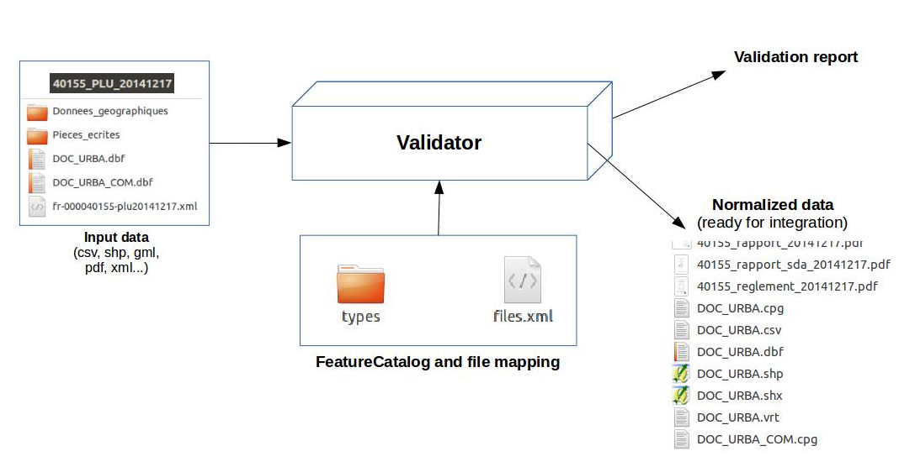

# Validator

[](https://travis-ci.org/IGNF/validator)

# Principe de fonctionnement



Ce programme permet de valider et de normaliser les données présentes dans une arborescence de fichiers. Ces données peuvent être :

* Des tables, géographiques ou non, aux formats CSV, GML, Shapefile ou MapInfo
* Des fiches de métadonnées
* Des fichiers PDF
* Des dossiers (principalement pour contrôle de présence)

Le paramétrage s'effectue à l'aide de fichiers XML décrivant :

* Des modèles de table (FeatureCatalogue : FeatureType/AttributeType)
* Un mapping de fichiers (chemin d'accès, obligatoire/conseillé/optionel, type: pdf, table, dossier, etc.)


# Licence

Voir [LICENCE.md](LICENCE.md)

# Documentation technique

* [validator-core](doc/model.md)
* [Metadata validation](doc/metadata.md)


# Cas d'utilisation

Ce programme a été développé dans le cadre du [géoportail de l'urbanisme](https://www.geoportail-urbanisme.gouv.fr) pour la validation des [standards CNIG](https://www.geoportail-urbanisme.gouv.fr/standard/).


# Installation de ogr2ogr

Le programme s'appuie sur l'exécutable ```ogr2ogr``` de GDAL pour la lecture des données géographiques en utilisant le format CSV comme un pivot.

## Versions testées

* 1.9.1
* 1.9.3
* 1.10.1
* 1.11.3

## Versions bannies

* 1.9.0 : Bug dans la production du WKT (limité à 8000 caractères)
* 2.1.* et 2.2.* : Régression dans la gestion de la précision des coordonnées WKT et difficultés pour contrôler le nombre de décimales avec OGR_WKT_PRECISION (précision globale)


# Compilation

```
mvn package
```

# document_validator

## Affichage de l'aide

```
java -jar validator-cli/target/validator-cli.jar document_validator --help
```

## Spécification du chemin vers ogr2ogr

```
java -Dogr2ogr_path=/path/to/ogr2ogr -jar validator-cli/target/validator-cli.jar document_validator --help
```

## Exemple modèle classique [GEOFLA](validator-example/geofla/README.md)

```
java -jar validator-cli/target/validator-cli.jar document_validator -c validator-example/geofla/config/ -v GEOFLA_2015 -i validator-example/geofla/data -s EPSG:2154 -W LATIN1
```

## Utilisation en mode validateur CNIG (GpU)

Pour le GPU, il convient de charger le plugin dédié via l'option ```--plugins```
