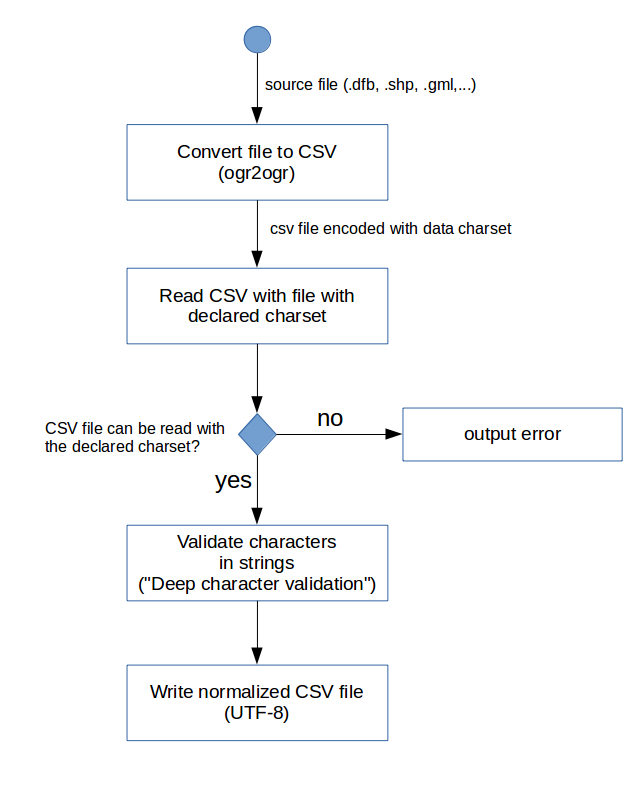

# Characters validation

## Data charset

The charset used to read data is either :

* The default value : UTF-8
* The value provided as a command line argument
* The value provided in a metadata file (```identificationInfo[1]/*/characterSet```)

(For now, value provided in companion file such as .cpg for shapefile is ignored because it may contains value such as "system")

## Data charset validation



## Deep character validation

Deep character validation is based on the attempt to apply the following transforms. A validation error is triggered if the string is modified.

TODO : 
* Create an error code per transform (currently, either an error or a warning is produced if the string is modified)
* Discuss separation between validation/normalization

### Double UTF-8 encoding

If a dataset encoded UTF-8 and declared as LATIN1, the reading process can't detect an error. Meanwhile, strings will contains character sequence rarely presents in real data.

The validator optionally search sequences of double encoded UTF-8 characters and replace them by original characters.

Command line option : ```--string-fix-utf8```

### Character simplification

The validator optionnaly apply character replacement to produce normalized data :

* With a better supports by main fonts (common simplification)
* That supports encoding in a given charset (charset specification simplification)

#### Common simplification

The file ```/validator-core/src/main/resources/simplify/common.csv``` defines this replacements.

Command line option : ```--string-simplify-common```

#### Charset specific simplification

The file ```/validator-core/src/main/resources/simplify/ISO-8859-1.csv``` defines this replacements for LATIN1.

Command line option : ```--string-simplify-charset <CHARSET>```

### Character escaping

#### Control characters

Non standard control characters are detected and escaped in hexadecimal form (ex : [\\u0092](http://www.fileformat.info/info/unicode/char/0092/index.htm))

Command line option : ```--string-escape-controls```

#### Characters not supported by specific charset

To ensure compatibility with a given charset, it is possible to escape unsupported characters too.

Command line option : ```--string-escape-charset <CHARSET>```
