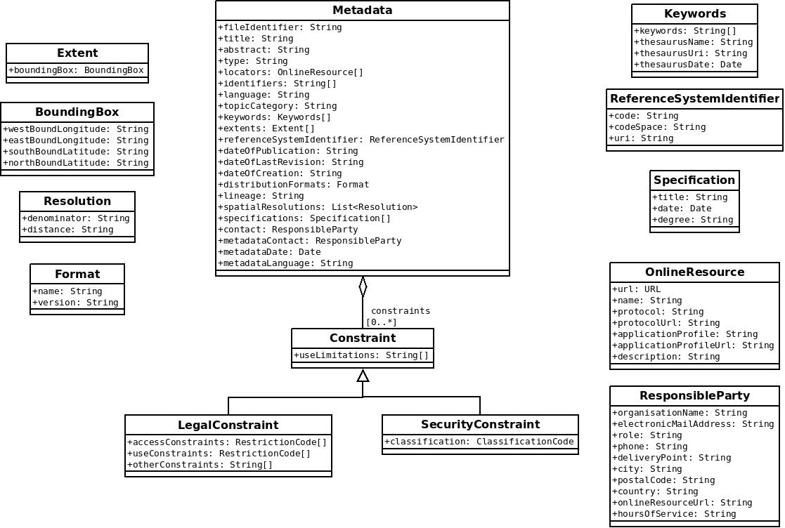

# Metadata

The following Metadata model is dedicated to validation according to INSPIRE and CNIG profiles. XML parsing is partial and based on XPath.

## Class diagram

The following profile is used to store metadata parsed from ISO 19915. Metadata attributes are based on INSPIRE requirements.



## Metadata properties

Metadata "attributes" with INSPIRE multiplicity for datasets according to INSPIRE_GUIDELINE_2017.

| name                      | type                            | title                                | multiplicity |
| ------------------------- | ------------------------------- | ------------------------------------ | ------------ |
| contraints                | `Contraint[]`                   | Resource constraints                 | [0..*]       |
| distributionFormats       | `Format`                        | Encoding                             | [0..*]       |
| spatialResolutions        | `Resolution`                    | Spatial resolution                   | [0..*]       |
| language                  | `LanguageCode`                  | Resource langage                     | [0..*] (1)   |
| referenceSystemIdentifier | `ReferenceSystemIdentifier`     | Coordinate Reference System          | [0..*] (1)   |
| dateOfPublication         | `Date`                          | Date of publication                  | [0..*] (1)   |
| contact                   | `ResponsibleParty`              | Responsible party                    | [0..*] (1)   |
| fileIdentifier            | `String`                        | File identifier                      | [0..1]       |
| dateOfLastRevision        | `Date`                          | Date of last revision                | [0..1]       |
| dateOfCreation            | `Date`                          | Date of creation                     | [0..1]       |
| locators                  | `OnlineResource[]`              | Resource locator                     | [1..*]       |
| identifiers               | `String[]`                      | Unique resource identifier           | [1..*]       |
| keywords                  | `Keywords`                      | Keyword                              | [1..*]       |
| extents                   | `Extent[]`                      | Extents with geographic bounding box | [1..*]       |
| specifications            | `Specification`                 | Specification title and degree       | [1..*]       |
| topicCategory             | `TopicCategoryCode`             | Topic category                       | [1..*] (1)   |
| characterSet              | `CharacterSetCode`              | Character Encoding                   | [1..*] (1)   |
| spatialRepresentationType | `SpatialRepresentationTypeCode` | Spatial representation type          | [1..*] (1)   |
| metadataContact           | `ResponsibleParty`              | Metadata point of contact            | [1..*] (1)   |
| title                     | `String`                        | Resource title                       | [1]          |
| abstract                  | `String`                        | Resource abstract                    | [1]          |
| type                      | `ScopeCode`                     | Resource type                        | [1]          |
| lineage                   | `String`                        | Lineage                              | [1]          |
| metadataDate              | `Date`                          | Metadata date                        | [1]          |
| metadataLanguage          | `LanguageCode`                  | Metadata langage                     | [1]          |

> (1) multiplicity is adapted, only the first element is parsed

## fileIdentifier

### Description

> When regularly harvesting metadata from discovery services of several Member States (as done by
> the EU INSPIRE geoportal), it is helpful to be able to identify duplicate metadata elements and
> updates of metadata records. This can be ensured by providing a globally unique and persistent
> identifier of the metadata record through the fileIdentifier element.

Source : INSPIRE_GUIDELINE_2017

### XPath

```(xpath)
fileIdentifier
```

### References

* INSPIRE_GUIDELINE_2017 - 2.2 General requirements / 2.2.1 File identifier (p11)
* CNIG_MD_DU - 1) Identification des données / fileIdentifier (p5)


## title

### Description

> Name by which the cited resource is known

Source : INSPIRE_GUIDELINE_2017

### XPath

```(xpath)
identificationInfo[1]/*/citation/*/title
```

### References

* INSPIRE_GUIDELINE_2017 - 2.3 Identification info section / 2.3.1 Resource title (p14)
* INSPIRE_GUIDELINE_2013 - 2.2 Identification / 2.2.1 Resource title (p17)
* CNIG_MD_DU - 1) Identification des données / Intitulé de la resource (p4)


## abstract

### Description

> Brief narrative summary of the content of the resource(s)

Source : INSPIRE_GUIDELINE_2017

### XPath

```(xpath)
identificationInfo[1]/*/abstract
```

### References

* INSPIRE_GUIDELINE_2017 - 2.3 Identification info section / 2.3.2 Resource abstract (p15)
* INSPIRE_GUIDELINE_2013 - 2.2 Identification / 2.2.2 Resource abstract (p18)
* CNIG_MD_DU - 1) Identification des données / Résumé de la resource (p4)


## type

### Description

> Scope to which metadata applies

Source : INSPIRE_GUIDELINE_2017

Example : dataset

### XPath

```(xpath)
hierarchyLevel
```

### References

* INSPIRE_GUIDELINE_2017 - 3.1.1.1 Resource type (p33)
* INSPIRE_GUIDELINE_2013 - 2.2 Identification / 2.2.3 Resource Type (p20)
* CNIG_MD_DU - 1) Identification des données / Type de la resource (p5)


## locators

### Description

> Location (address) for on-line access using a Uniform Resource
> Locator address or similar addressing scheme

Source : INSPIRE_GUIDELINE_2017

### XPath

```(xpath)
distributionInfo/*/transferOptions/*/onLine/*/linkage
```

### References

* INSPIRE_GUIDELINE_2017 - 3.1.3.1 Resource locator for data set or series (p42)
* INSPIRE_GUIDELINE_2013 - 2.2 Identification / 2.2.4 Resource locator (p21)
* CNIG_MD_DU - 1) Identification des données / Localisateur de la ressource (p5)


## identifiers

### Description

> Value uniquely identifying an object within a namespace

Source : INSPIRE_GUIDELINE_2017

### XPath

```(xpath)
identificationInfo[1]/*/citation/*/identifier/*/code
```

### References

* INSPIRE_GUIDELINE_2017 - 3.1.2.1 Unique resource identifier (p34)
* INSPIRE_GUIDELINE_2013 - 2.2 Identification / 2.2.5 Unique resource identifier (p24)
* CNIG_MD_DU - 1) Identification des données / Identificateur de ressource unique (p5)


## language

### Description

> Language(s) used within the datasets

Source : INSPIRE_GUIDELINE_2017


### XPath

```(xpath)
identificationInfo[1]/*/language
```

### References

* INSPIRE_GUIDELINE_2017 - 3.1.2.4 Resource language (p40)
* INSPIRE_GUIDELINE_2013 - 2.2 Identification / 2.2.7 Resource langage (p26)
* CNIG_MD_DU - 1) Identification des données / Langue de la ressource (p6)


## topicCategory

### Description

> Main theme(s) of the dataset

Source : INSPIRE_GUIDELINE_2017

### XPath

```(xpath)
identificationInfo[1]/*/topicCategory
```

### References

* INSPIRE_GUIDELINE_2013 - 2.3 Classification of spatial data and services / 2.3.1 Topic category (p27)
* CNIG_MD_DU - 2) Classification des données et services géographiques / Catégorie thématique (p7)


## keywords

### Description

#### Keyword values

> Commonly used word(s) or formalised word(s) or phrase(s) used to
> describe the subject

Source : INSPIRE_GUIDELINE_2017

#### Thesaurus

> Name of the formally registered thesaurus or a similar authoritative
> source of keywords

Source : INSPIRE_GUIDELINE_2017

### XPath

```(xpath)
identificationInfo[1]/*/descriptiveKeywords/*/keyword
identificationInfo[1]/*/descriptiveKeywords/*/thesaurusName
```

### References

* INSPIRE_GUIDELINE_2017 - 2.3.5 Using keywords (p20)
* INSPIRE_GUIDELINE_2013 - 2.3 Classification of spatial data and services / 2.4 Keyword (p31)
* CNIG_MD_DU - 3) Mots-clés (p8)


## extents

### Description

> Defining the geographic containing boundary of the described resource enables searches for
> resources using their area or location of interest.

Source : INSPIRE_GUIDELINE_2017

### XPath

```(xpath)
identificationInfo[1]/*/extent/*/geographicElement/*/westBoundLongitude
identificationInfo[1]/*/extent/*/geographicElement/*/eastBoundLongitude
identificationInfo[1]/*/extent/*/geographicElement/*/southBoundLatitude
identificationInfo[1]/*/extent/*/geographicElement/*/northBoundLatiTude
```

### References

* INSPIRE_GUIDELINE_2017 - 2.3.8 Geographic bounding box (p27-28)
* INSPIRE_GUIDELINE_2013 - 2.5 Geographic location / 2.5.1 Geographic bounding box (p35)
* CNIG_MD_DU - 4) Situation géographique / Rectangle de délimitation géographique (p9)


## referenceSystemIdentifier

### Description

> Describing the coordinate reference system(s) used in the data set makes discovering data sets with
> spatial coordinates provided in desired reference systems possible.

Source : INSPIRE_GUIDELINE_2017

### XPath

```(xpath)
referenceSystemInfo/*/referenceSystemIdentifier/*/code
```

### References

* INSPIRE_GUIDELINE_2017 - 3.2.1.1 Coordinates reference systems (p48)
* CNIG_MD_DU - 4) Situation géographique / Référentiel de coordonnées (p9)


## dateOfPublication

### Description

> Reference date for the cited resource - publication

Source : INSPIRE_GUIDELINE_2017

### XPath

```(xpath)
identificationInfo[1]/*/citation/*/date[./*/dateType/*/text()='publication’/*/date
```

### References

* INSPIRE_GUIDELINE_2017 - 2.3.4 Temporal references (p17)
* INSPIRE_GUIDELINE_2013 - 2.6 Temporal reference / 2.6.2 Date of publication (p38)


## dateOfLastRevision

### Description

> Reference date for the cited resource - revision

Source : INSPIRE_GUIDELINE_2017

### XPath

```(xpath)
identificationInfo[1]/*/citation/*/date[./*/dateType/*/text()='revision']/*/date
```

### References

* INSPIRE_GUIDELINE_2017 - 2.3.4 Temporal references (p17)
* INSPIRE_GUIDELINE_2013 - 2.6 Temporal reference / 2.6.3 Date of last revision (p40)
* CNIG_MD_DU - 5) Références temporelles / Dates de référence (p10)


## dateOfCreation

### Description

> Reference date for the cited resource - creation

Source : INSPIRE_GUIDELINE_2017

### XPath

```(xpath)
identificationInfo[1]/*/citation/*/date[./*/dateType/*/text()='creation']/*/date
```

### References

* INSPIRE_GUIDELINE_2017 - 2.3.4 Temporal references (p17)
* INSPIRE_GUIDELINE_2013 - 2.6 Temporal reference / 2.6.4 Date of creation (p38)


## characterSet

### Description

> The character encoding describes the way the characters of the textual information are encoded in the
> described data set.
> [...]
> The multiplicity of this element is zero or more: this element is only required if there are non UTF-8
> based character encodings used in the data set.

Source : INSPIRE_GUIDELINE_2017

### XPath

```(xpath)
identificationInfo[1]/*/characterSet
```

### References

* CNIG_MD_DU - Encodage - (p6)


## contraints

### Description

> Conditions applying to access and use

> Conditions applying to use

> Limitations on public access

Source : INSPIRE_GUIDELINE_2017

[details about constraints](resourceConstraints.md)

### XPath

```(xpath)
identificationInfo[1]/*/resourceConstraints/*
```

### References

* INSPIRE_GUIDELINE_2013 - 2.9 Constraints related to access and use (p51-55)


## distributionFormats

### Description

> Description of the computer language construct(s) specifying the
> representation of data objects in a record, file, message, storage device
> or transmission channel.

Source : INSPIRE_GUIDELINE_2017

### XPath

```(xpath)
distributionInfo/*/distributionFormat/*/name
distributionInfo/*/distributionFormat/*/version
```

### References

* CNIG_MD_DU - Encodage - (p6)


## spatialRepresentationType

### Description

> The method used to spatially represent geographic information

### XPath

```(xpath)
identificationInfo[1]/*/spatialRepresentationType
```

### References

* CNIG_MD_DU - Type de représentation géographique - (p7)


## lineage

### Description

> General explanation of the data producer’s knowledge about the
> lineage of a dataset

Source : INSPIRE_GUIDELINE_2017

### XPath

```(xpath)
dataQualityInfo/*/lineage/*/statement
```

### References

* INSPIRE_GUIDELINE_2013 - 2.7 Quality and validity / 2.7.1 Lineage (p42)
* CNIG_MD_DU - 6) Qualité et validité / Généalogie (p10)


## spatialResolutions

### Description

> Equivalent scale: level of detail expressed as the scale denominator of a comparable hardcopy map or chart
>
> Distance: ground sample distance

Source : INSPIRE_GUIDELINE_2017

### XPath

```(xpath)
identificationInfo[1]/*/spatialResolution/*/equivalentScale/*/denominator (equivalent scale)
identificationInfo[1]/*/spatialResolution/*/distance (distance)
```

### References

* INSPIRE_GUIDELINE_2013 - 2.7 Quality and validity / 2.7.2 Spatial resolution (p45)
* CNIG_MD_DU - 6) Qualité et validité / Résolution spatiale (p10)


## specifications

### Description

#### title

> Citation of the product specification or user requirement against which
> data is being evaluated

Source : INSPIRE_GUIDELINE_2017

#### degree

> Indication of the conformance result

Source : INSPIRE_GUIDELINE_2017

### XPath

```(xpath)
dataQualityInfo/*/report/*/result/*/specification 
dataQualityInfo/*/report/*/result/*/pass
```

### References

* INSPIRE_GUIDELINE_2013 - 2.8 Conformity / 2.8.2 Specification (p49)
* CNIG_MD_DU - 7) Conformité / Spécification (p12)
* 
* INSPIRE_GUIDELINE_2013 - 2.8 Conformity / 2.8.1 Degree (p48)
* CNIG_MD_DU - 7) Conformité / Degré (p12)


## contact

### Description

> Identification of, and means of communication with, person(s) and
> organization(s) associated with the resource(s)

### XPath

```(xpath)
identificationInfo[1]/*/pointOfContact/*/organisationName
identificationInfo[1]/*/pointOfContact/*/address/*/electronicMailAddress
identificationInfo[1]/*/pointOfContact/*/role
```

### References

* INSPIRE_GUIDELINE_2017 - 2.3 Identification info section / 2.3.3 Responsible organisation and point of contact for the described resource (p16)
* INSPIRE_GUIDELINE_2013 - 2.10 Responsible organisation (p55)
* CNIG_MD_DU - 9) Organisation responsable de l’établissement, de la gestion, 
* de la maintenance et de la diffusion des séries de données (p15)


## metadataContact

### Description

> Party responsible for the metadata information

Source : INSPIRE_GUIDELINE_2017


### XPath

```(xpath)
contact*/organisationName
contact/*/address/*/electronicMailAddress
contact/*/role
```

### References

* INSPIRE_GUIDELINE_2013 - 2.11 Metadata on metadata / 2.11.1 Metadata point of contact (p55)
* CNIG_MD_DU - 10) Métadonnées concernant les métadonnées / Point de contact pour la métadonnées (p15)


## metadataDate

### Description

> Date that the metadata was created

Source : INSPIRE_GUIDELINE_2017

### XPath

```(xpath)
dateStamp
```

### References

* INSPIRE_GUIDELINE_2013 - 2.11 Metadata on metadata / 2.11.2 Metadata date (p60)
* CNIG_MD_DU - 10) Métadonnées concernant les métadonnées / Date des métadonnées (p15)


## metadataLanguage

### Description

> Language used for documenting metadata

Source : INSPIRE_GUIDELINE_2017

### XPath

```(xpath)
language
```

### References

* INSPIRE_GUIDELINE_2013 - 2.11.3 Metadata language / 2.11.3 Metadata langage (p60)
* CNIG_MD_DU - 10) Métadonnées concernant les métadonnées / Langue des métadonnées (p15)


## Resources

### Documents (english)

* INSPIRE_GUIDELINE_2017 : [Technical Guidance for the implementation of
INSPIRE dataset and service metadata based
on ISO/TS 19139:2007](https://inspire.ec.europa.eu/id/document/tg/metadata-iso19139)

https://inspire.ec.europa.eu/id/document/tg/metadata-iso19139

* INSPIRE_GUIDELINE_2013: [INSPIRE Metadata Implementing
Rules: Technical Guidelines based
on EN ISO 19115 and EN ISO 19119](https://inspire.ec.europa.eu/documents/inspire-metadata-implementing-rules-technical-guidelines-based-en-iso-19115-and-en-iso-1)

### Documents (french)

* CNIG_MD_INSPIRE - [Guide de saisie des éléments
de métadonnées INSPIRE - juillet 2014](http://inspire.ec.europa.eu/documents/Metadata/MD_IR_and_ISO_20131029.pdf)

* CNIG_MD_DU - [CNIG - Consignes de saisie des
Métadonnées INSPIRE pour les
documents d’urbanisme - septembre 2017](http://cnig.gouv.fr/wp-content/uploads/2017/09/170914_consignes_saisie_metadonnees_DU_vprojet.pdf)

* CNIG_MD_SUP - [CNIG - Consignes de saisie des
Métadonnées INSPIRE pour les
servitudes d’utilité publique](http://cnig.gouv.fr/wp-content/uploads/2017/09/170914_consignes_saisie_metadonnees_SUP_vprojet.pdf)

### Normative references

* [ISO 19115-1:2014 - Geographic information -- Metadata -- Part 1: Fundamentals](https://www.iso.org/fr/standard/53798.html)
* [ISO/TS 19139:2007 - Geographic information -- Metadata -- XML schema implementation](https://www.iso.org/standard/32557.html)

### XSD schemas and resources

* [http://www.isotc211.org/2005/](http://www.isotc211.org/2005/)
* [http://www.isotc211.org/2005/resources/Codelist/gmxCodelists.xml](http://www.isotc211.org/2005/resources/Codelist/gmxCodelists.xml)

* [http://inspire.ec.europa.eu/metadata-codelist/](INSPIRE metadata code list register)
* [ISO 19115 and 19115-2 CodeList Dictionaries](https://geo-ide.noaa.gov/wiki/index.php?title=ISO_19115_and_19115-2_CodeList_Dictionaries)

### Third part tools

* [http://www.isotc211.org/2005/gmd - schema explorer](http://www.datypic.com/sc/niem21/ns-gmd.html)
* [INSPIRE metadata validator](http://inspire-geoportal.ec.europa.eu/validator2/)
