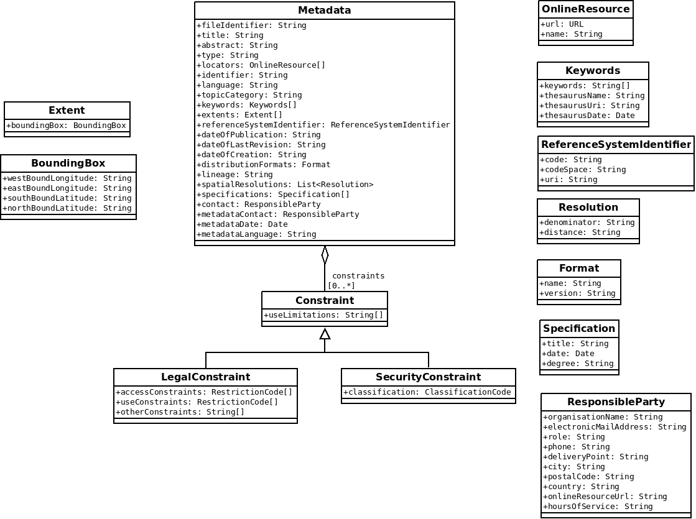

# Principles

* Metadata are validated according to INSPIRE and CNIG profiles
* Metadata model is dedicated to INSPIRE and CNIG profiles
* Metatada parsing is partial and based on XPath

# Metadata model - ISO 19115 profile for INSPIRE validation

## Class diagram

The following profile is used to store metadata parsed from ISO 19915. Metadata attributes are based on INSPIRE requirements.

## Classes

* [Metadata](metadata.md)

# Resources

## Normative references

* [ISO 19115-1:2014 - Geographic information -- Metadata -- Part 1: Fundamentals](https://www.iso.org/fr/standard/53798.html) 
* [ISO/TS 19139:2007 - Geographic information -- Metadata -- XML schema implementation](https://www.iso.org/standard/32557.html)

## XSD schemas and resources

* [http://www.isotc211.org/2005/](http://www.isotc211.org/2005/)
* [http://www.isotc211.org/2005/resources/Codelist/gmxCodelists.xml](http://www.isotc211.org/2005/resources/Codelist/gmxCodelists.xml)

* [http://inspire.ec.europa.eu/metadata-codelist/](INSPIRE metadata code list register)
* [ISO 19115 and 19115-2 CodeList Dictionaries](https://geo-ide.noaa.gov/wiki/index.php?title=ISO_19115_and_19115-2_CodeList_Dictionaries)

## Documents (english)

* INSPIRE_GUIDELINE_2017 : [Technical Guidance for the implementation of
INSPIRE dataset and service metadata based
on ISO/TS 19139:2007](https://inspire.ec.europa.eu/id/document/tg/metadata-iso19139)

https://inspire.ec.europa.eu/id/document/tg/metadata-iso19139

* INSPIRE_GUIDELINE_2013: [INSPIRE Metadata Implementing
Rules: Technical Guidelines based
on EN ISO 19115 and EN ISO 19119](https://inspire.ec.europa.eu/documents/inspire-metadata-implementing-rules-technical-guidelines-based-en-iso-19115-and-en-iso-1)

## Documents (french)

* CNIG_MD_INSPIRE - [Guide de saisie des éléments
de métadonnées INSPIRE - juillet 2014](http://inspire.ec.europa.eu/documents/Metadata/MD_IR_and_ISO_20131029.pdf)

* CNIG_MD_DU - [CNIG - Consignes de saisie des
Métadonnées INSPIRE pour les
documents d’urbanisme - septembre 2017](http://cnig.gouv.fr/wp-content/uploads/2017/09/170914_consignes_saisie_metadonnees_DU_vprojet.pdf)

* CNIG_MD_SUP - [CNIG - Consignes de saisie des
Métadonnées INSPIRE pour les
servitudes d’utilité publique](http://cnig.gouv.fr/wp-content/uploads/2017/09/170914_consignes_saisie_metadonnees_SUP_vprojet.pdf)

## Third part tools

* [http://www.isotc211.org/2005/gmd - schema explorer](http://www.datypic.com/sc/niem21/ns-gmd.html)
* [INSPIRE metadata validator](http://inspire-geoportal.ec.europa.eu/validator2/)
